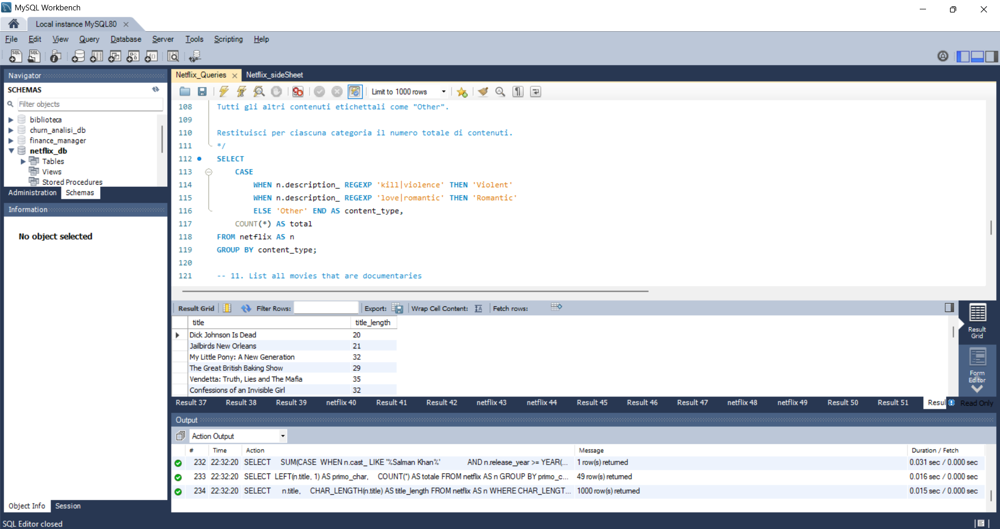

Perfetto, restiamo in pista 😎. Ecco il tuo README aggiornato in versione **GitHub-friendly**, con tutti i file e le immagini linkati correttamente, pronto da copiare in `README.md`:

```markdown
---

# 📘 Netflix Data Analysis Using SQL

Analisi completa del dataset Netflix tramite MySQL: creazione database, import dei dati, pulizia, trasformazioni e oltre 15 query avanzate (CTE, window functions, parsing stringhe, classificazione testuale, ranking e cumulative totals).

Il progetto riproduce il flusso di lavoro tipico di un Data Engineer:  
dataset grezzo → import → cleaning → analisi SQL strutturata → documentazione finale.

---

## 🎯 Obiettivi del progetto

L’obiettivo è dimostrare capacità operative su dati reali attraverso tecniche avanzate di SQL:

* Analizzare il dataset ufficiale Netflix tramite MySQL.
* Effettuare data wrangling con SQL puro, senza tool esterni.
* Applicare strategie avanzate: CTE, Window Functions, REGEXP, parsing stringhe.

---

## 🛠️ Tecniche e strumenti utilizzati

* **MySQL 8.0**  
  CTE, Window Functions, STR_TO_DATE, SUBSTRING, SUBSTRING_INDEX, REGEXP, PERCENT_RANK(), SUM() OVER, CAST.
* **String parsing**:  
  LEFT(), RIGHT(), SUBSTRING(), SUBSTRING_INDEX(), CAST(... AS UNSIGNED).
* **Classificazione testuale** tramite REGEXP.
* **Tecniche analitiche**: ranking, cumulative totals, percentuali, conteggi su partizioni.
* **Gestione dati**: creazione schema, import CSV con LOAD DATA INFILE, controllo lunghezze colonne, pulizia campi.

---

## 📂 Struttura del repository

```

Progetti/
└─ Netflix Data Analysis Using SQL/
├─ Data/
│  └─ netflix_titles.csv
├─ Images/
│  └─ Interfaccia_di_lavoro.png
├─ SQL/
│  ├─ 01_Netflix_Create_table&Import.sql
│  ├─ 02_Netflix_Queries.sql
│  └─ 03_Netflix_sideSheet.sql
└─ README.md

```

---

## 🧾 Contenuto dei file SQL

### **[01_Netflix_Create_table&Import.sql](./SQL/01_Netflix_Create_table&Import.sql)**

* Creazione del database `netflix_db`.
* Creazione tabella `netflix` con schema coerente al CSV.
* Importazione tramite **LOAD DATA INFILE**.

### **[02_Netflix_Queries.sql](./SQL/02_Netflix_Queries.sql)**

Include le analisi principali:

* Count the number of Movies vs TV Shows
* Find the most common rating for movies and TV shows
* List all movies released in a specific year (e.g., 2020)
* Percentile di durata dei film per rating (window function) – “Quanto è lungo questo film rispetto ai suoi simili?”
* Identify the longest movie
* Find content added in the last 5 years
* Find all the movies/TV shows by director 'Rajiv Chilaka'
* List all TV shows with more than 5 seasons
* Cumulative count di contenuti per anno (running total)
* Categorizza i contenuti Netflix in: Violent / Romantic / Other in base alla descrizione, e conta quanti ce ne sono per categoria
* List all movies that are documentaries
* Find all content without a director
* Find how many movies actor 'Salman Khan' appeared in last 10 years
* Raggruppamento per primo carattere del titolo (GROUPING SETS style)
* Find all content with title length above the average

### **[03_Netflix_sideSheet.sql](./SQL/03_Netflix_sideSheet.sql)**

Foglio laterale operativo utilizzato durante lo sviluppo:

* Test intermedi delle query.
* Normalizzazioni stringhe.
* Prove di REGEXP e parsing.

---

## 🖼️ Screenshot

**Interfaccia di lavoro MySQL Workbench**



---

## 📥 Dataset

Dataset originale in formato CSV:  
[Netflix_titles.csv](./Data/netflix_titles.csv)


---

## 🎓 Cosa ho imparato durante il progetto

Durante lo sviluppo ho consolidato competenze fondamentali per un Data Engineer:

### **Import e qualità dei dati**

* Differenza tra file americani ed europei (virgole, date, encoding).
* Import tramite **LOAD DATA INFILE**.
* Workbench mostra solo 1000 righe → necessità di query mirate di verifica.
* Uso di `MAX(LENGTH(campo))` per verificare dimensioni corrette delle colonne.
* Concetto MySQL: lo *schema* è il *database*.

### **Pulizia e trasformazione dati**

* Parsing con `SUBSTRING()`, `SUBSTRING_INDEX()`, `LEFT()`, `RIGHT()`.
* Normalizzazione valori numerici con `CAST(... AS UNSIGNED)`.
* Scelta di usare `_` nei nomi colonna per evitare conflitti con parole chiave.
* Differenza tra approccio manuale e import automatizzato.

### **SQL avanzato**

* Differenza tra `PARTITION BY` e `GROUP BY`.
* Uso pratico delle Window Functions: cumulative count, ranking, **PERCENT_RANK()**.
* Riferimenti numerici nella `SELECT`.
* REGEXP per classificazione testi.
* Divieto di usare funzioni aggregate senza `GROUP BY` quando richiesto.

### **Troubleshooting**

* Risoluzione errori import con LOAD DATA INFILE.
* Analisi cause: permessi, path, encoding, formati date, file di configurazione my.ini.
* Debug incrementale tramite side sheet SQL.

---

## 📌 Cosa dimostra questo progetto

* Capacità di progettare e documentare un flusso SQL completo da Data Engineer.
* Competenza nell’uso avanzato di MySQL e funzioni analitiche.
* Attenzione alla struttura del codice e alle buone pratiche.
* Abilità nel presentare un progetto tecnico in modo chiaro e leggibile.

---

## 📎 Contatti

**LinkedIn:** [https://www.linkedin.com/in/fokou-alex-679014212/](https://www.linkedin.com/in/fokou-alex-679014212/)  
**Email:** [teddyalex.fokou@mail.polimi.it](mailto:teddyalex.fokou@mail.polimi.it)

